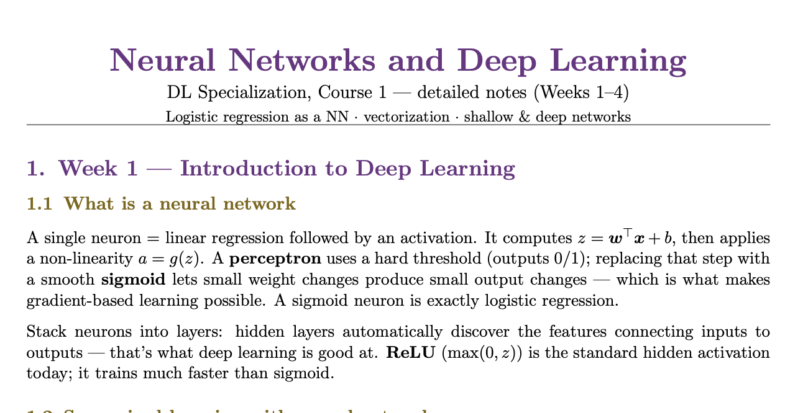

# Coursera Deep Learning Specialization — Revision Notes (Andrew Ng)

Concise, detailed study notes for all 5 courses of the Deep Learning Specialization by Andrew Ng on Coursera.

**Course:** Deep Learning Specialization  
**Offered by:** Coursera — DeepLearning.AI  
**Instructor:** Prof. Andrew Ng  
**Course Link:** [Coursera Course Page](https://www.coursera.org/specializations/deep-learning)

---

---

## Notes

| Course | Topic | View |
|--------|-------|------|
| Course 1 | Neural Networks and Deep Learning | [View Notes](https://docs.google.com/viewer?url=https://raw.githubusercontent.com/caitlin-leonard/coursera-andrew-ng-deep-learning-notes/main/DL_Course1_Neural_Networks_Notes.pdf) |
| Course 2 | Improving Deep Neural Networks | [View Notes](https://docs.google.com/viewer?url=https://raw.githubusercontent.com/caitlin-leonard/coursera-andrew-ng-deep-learning-notes/main/DL_Course2_Improving_DNNs_Notes.pdf) |
| Course 3 | Structuring ML Projects | [View Notes](https://docs.google.com/viewer?url=https://raw.githubusercontent.com/caitlin-leonard/coursera-andrew-ng-deep-learning-notes/main/DL_Course3_Structuring_ML_Projects_Notes.pdf) |
| Course 4 | Convolutional Neural Networks | [View Notes](https://docs.google.com/viewer?url=https://raw.githubusercontent.com/caitlin-leonard/coursera-andrew-ng-deep-learning-notes/main/DL_Course4_CNNs_Notes.pdf) |
| Course 5 | Sequence Models | [View Notes](https://docs.google.com/viewer?url=https://raw.githubusercontent.com/caitlin-leonard/coursera-andrew-ng-deep-learning-notes/main/DL_Course5_Sequence_Models_Notes.pdf) |

---

## License
These notes are released under [The Unlicense](https://unlicense.org/).
Free to use, share, and adapt — no attribution required.
